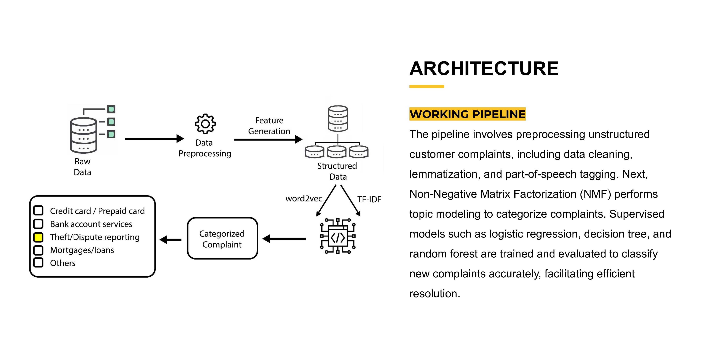
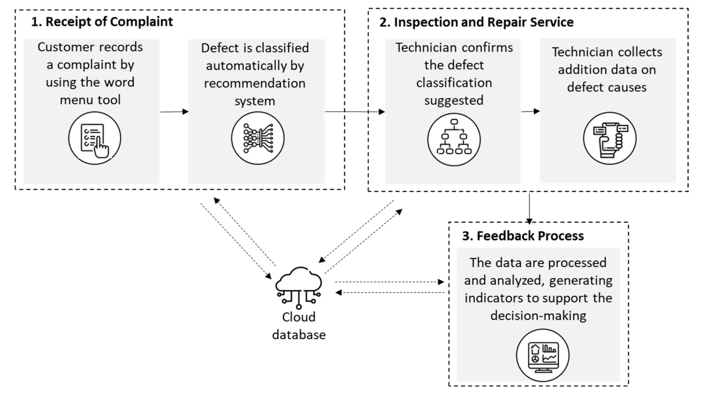
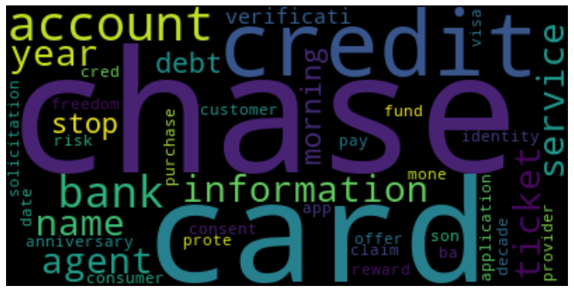

# ReSolveAI — AI Complaint Classification Engine 🧭🤖

[]()
[]()
[]()

> **Automated Complaint Understanding for Financial Services**  
> ReSolveAI transforms unstructured customer complaints into actionable, categorized insights using NLP, topic modeling, and supervised machine learning.  
> This project blends practical engineering with research-grade experimentation.  
>  
> 📄 *Full Report & Slides included (see Resources section).* 


## 🔍 Overview

**ReSolveAI** is an end-to-end AI engine that:

- Cleans and preprocesses raw complaint text  
- Extracts meaningful patterns using **TF-IDF**  
- Discovers hidden topics with **Non-Negative Matrix Factorization (NMF)**  
- Uses these topics to train classification models  
- Produces automated complaint category predictions with explainability

Why ReSolveAI matters:

- ⚡ Faster resolution  
- 🎯 Higher routing accuracy  
- 💸 Reduced operational overhead  
- 😊 Improved customer satisfaction

This project analyzed **78,313+ complaint records** across **22 metadata fields**, using label-aligned topic clusters from NMF.  
:contentReference[oaicite:2]{index=2}

---

## 📁 Repository Structure

<div>├─ README.md</div>
<div>├─ src/</div>
<div>│ ├─ notebook.ipynb</div>
<div>├─ dataset/</div>
<div>│ ├─ complaints-2021-05-14_08_16.json</div>
<div>├─ docs/</div>
<div>│ ├─ architecture.png</div>
<div>│ ├─ workflow.png</div>
<div>│ ├─ eda_wordcloud.png</div>
<div>│ └─ hero.gif</div>
<div>├─ report.pdf</div>
<div>└─ presentation.pdf


---

## ✨ Key Features

- 🔤 **NLP Pipeline**: tokenization, lemmatization, POS tagging, stopword filtering  
- 🔍 **Topic Modeling with NMF** – reveals semantic clusters  
- 🧮 **Multiple ML Classifiers**  
  - Logistic Regression (**≈95% accuracy**)  
  - Decision Tree  
  - Random Forest  
  - Gaussian Naive Bayes  
  (LR was the top performer.)  
- 🎨 **Rich EDA**: histograms, distributions, n-grams, word clouds  
- ⚙️ **Complete Inference Pipeline**: ready for deployment  
- 🧪 **Interpretability**: TF-IDF feature importance, topic keywords  
- 📚 **Full research documentation in PDF**  

---

## 🏗 System Architecture

<div align="center">
  
  <p><em>Architecture: Ingestion → Processing → Topic Modeling → ML Classifier → Prediction</em></p>
</div>

---

## 🔄 Workflow

<div align="center">
  
  <p><em>Model Workflow: Data → Clean → TF-IDF → NMF → Classifier → Results</em></p>
</div>

---

## 📊 Exploratory Data Analysis

<div align="center">
  
  <p><em>Word Cloud of Most Frequent Complaint Tokens</em></p>
</div>

From the dataset EDA:  
- Strong presence of tokens like *payment, credit, account, dispute, reporting*  
- Complaints map naturally into financial service categories  
- Topic-token alignment validated using NMF factors  
:contentReference[oaicite:3]{index=3}

---

## 🚀 Getting Started

### 1️⃣ Clone the repository
```bash
git clone https://github.com/kalpthakkar/JobPilot-AI.git
cd jobpilot_ai
```

### 2️⃣ Create Python Environment
```bash
python -m venv .venv_resolveai

# macOS/Linux
source .venv_resolveai/bin/activate


# Windows
.venv_resolveai\Scripts\activate
# Powershell
.venv_resolveai\Scripts\Activate.ps1
```

### 3️⃣ Run Notebook
```bash
jupyter lab src/notebook.ipynb
```

---

## 🧠 Example: End-to-End Model Pipeline

```python
from sklearn.feature_extraction.text import TfidfVectorizer
from sklearn.decomposition import NMF
from sklearn.linear_model import LogisticRegression
from sklearn.model_selection import train_test_split
from sklearn.metrics import classification_report

tfidf = TfidfVectorizer(max_df=0.95, min_df=2, ngram_range=(1,2))
X = tfidf.fit_transform(df['clean_complaint'])

nmf = NMF(n_components=5, random_state=42)
W = nmf.fit_transform(X)

y = W.argmax(axis=1)

X_train, X_test, y_train, y_test = train_test_split(
    X, y, test_size=0.2, random_state=42
)

clf = LogisticRegression(max_iter=1000)
clf.fit(X_train, y_train)

print(classification_report(y_test, clf.predict(X_test)))
```

---

## 📈 Results Summary

Overall Model Performance

| Model                   | Accuracy   | Notes                    |
| ----------------------- | ---------- | ------------------------ |
| **Logistic Regression** | ⭐ **≈95%** | Best performer           |
| Decision Tree           | ~77%       | Interpretable            |
| Random Forest           | ~72–74%    | Stable but overfit-prone |
| Gaussian NB             | ~36%       | Weak baseline            |


- ✔ LR chosen as final classifier
- ✔ Well-separated NMF topics improved class clarity
- ✔ Topic-word alignment validated


---


## 🧩 Future Enhancements
- Fine-tuned transformer models (GPT, BERT, DistilBERT)
- Real-time ingestion with Kafka
- FastAPI inference service
- Active learning loop from agent feedback
- Multi-modal complaint classification (voice → transcripts → NLP)

## 📚 Resources

### 📄 Full Research Report (PDF)
<a href="report.pdf" target="_blank">

</a>

### 📑 Project Presentation (Slides)
<a href="presentation.pdf" target="_blank">

</a>

## 💬 Frequently Asked Questions (FAQ)
<div>
<details open>
<summary><h3>Q: What dataset did you use?</h3></summary>
<ul><p>A dataset of 78,313 customer complaints, with 22 columns, provided in JSON format.</p></ul>
</details>

<details open>
<summary><h3>Q: What dataset did you use?</h3></summary>
<ul><p>A dataset of 78,313 customer complaints, with 22 columns, provided in JSON format.</p></ul>
</details>
</div>

Q: Why NMF for topic modeling?
NMF provides sparse, interpretable topics that align well with complaint categories.

Q: Why did Logistic Regression perform best?
High-dimensional TF-IDF vectors naturally favor linear decision boundaries.

Q: Can this model run in production?
Yes — TF-IDF + LR is fast, light, and easily containerizable.

Q: How is bias or PII handled?
Remove PII (names, IDs, emails) and evaluate demographic fairness before launch.


## 🧾 Citation / Acknowledgements
This project was developed by Kalp Devangbhai Thakkar
University of Central Florida Machine Learning Project
References and full experiments in report.pdf and slides

Bird, Klein & Loper — Natural Language Processing with Python (NLTK).

Pedregosa et al. — Scikit-learn.

Lee & Seung — NMF (Nature, 1999).

See full bibliography in report.pdf

## 🤝 Contributing

- `Fork` repository

    ```url
    https://github.com/kalpthakkar/ReSolveAI-AI-Complaint-Classification-Engine/fork
    ```

- Create a `branch`: 

    ```bash
    git checkout -b feature-xyz
    ```

- `Commit` your changes
    ```bash
    # Stage changes
    git add .

    # Commit
    git commit -m "Your message"

    # Push the new branch
    git push -u origin feature-xyz
    ```

- Submit a `Pull Request`
    ```bash
    gh pr create --fill
    ```

---

## ❤️ Final Note
ReSolveAI showcases how classical NLP + topic modeling + supervised ML can deliver real, measurable impact in customer complaint handling pipelines.
This repository demonstrates research quality, engineering quality, and practical industry relevance - all in one project.

---

## 📞 Contact

For any inquiries or support, please contact:

- **Kalp Thakkar** - [kalpthakkar2001@gmail.com](mailto:kalpthakkar2001@gmail.com)
- **GitHub**: [kalpthakkar](https://github.com/kalpthakkar)
- **LinkedIn**: [kalpthakkar](https://www.linkedin.com/in/kalpthakkar)

